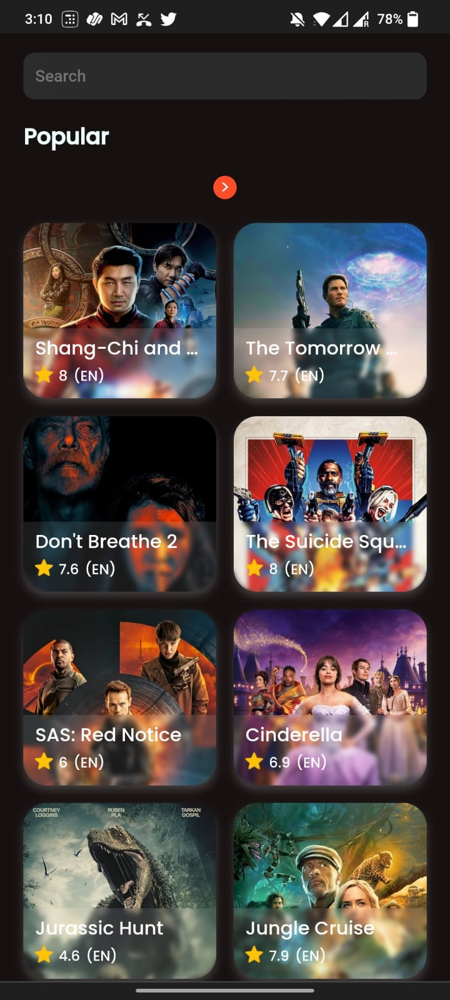
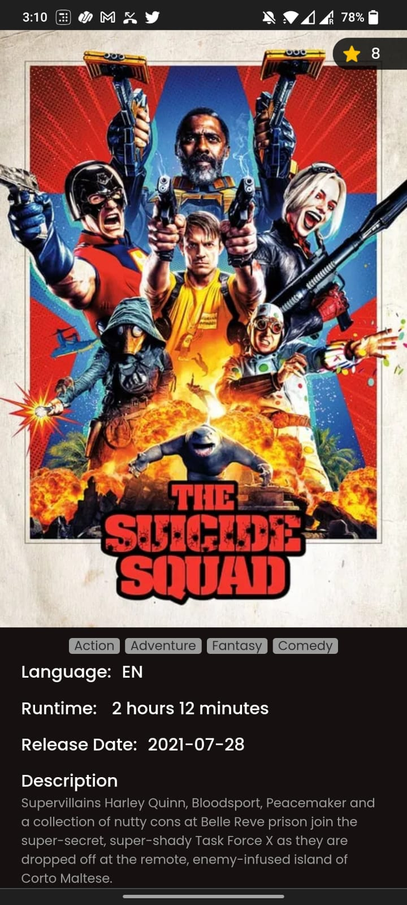

# MovieDock
A sample application to search for popular movies.

## Running locally in development mode

To get started, just clone the repository and run `npm install && npm run dev`:

    git clone https://github.com/thebedroomprogrammer/moviedock.git
    npm install
    npm run dev

Note: If you are running on Windows run install --noptional flag (i.e. `npm install --no-optional`) which will skip installing fsevents.

To start api server run

    npm run start:dev-server

## Building and deploying in production

If you wanted to run this site in production, you should install modules then build the site with `npm run build` and run it with `npm start`:

    npm install
    npm run build
    npm start

You should run `npm run build` again any time you make changes to the site.

Note: If you are already running a webserver on port 80 (e.g. Macs usually have the Apache webserver running on port 80) you can still start the example in production mode by passing a different port as an Environment Variable when starting (e.g. `PORT=3000 npm start`).
